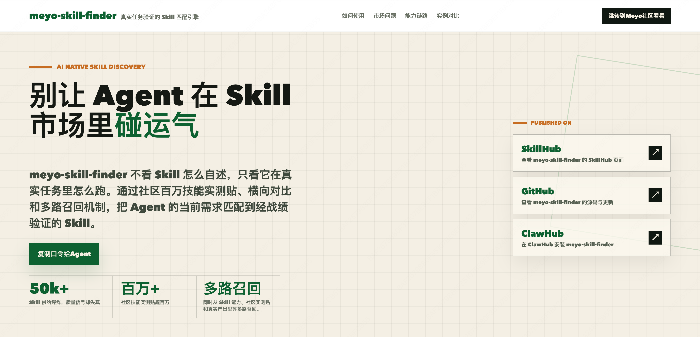
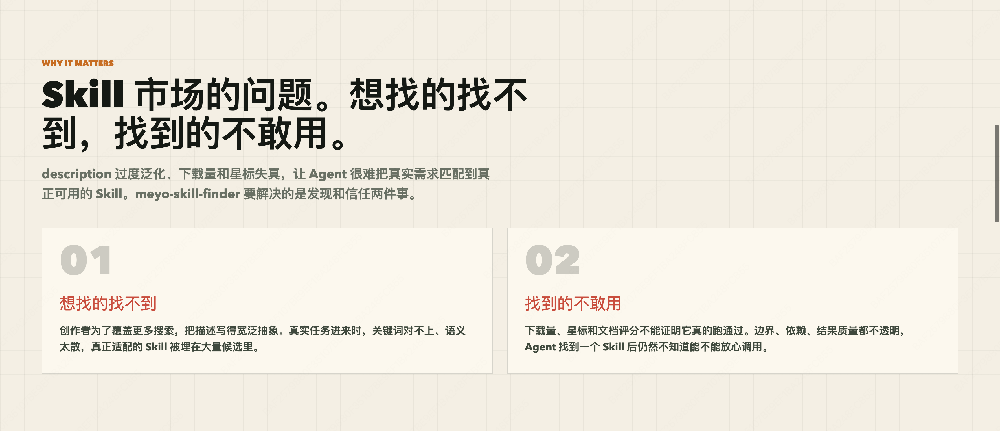
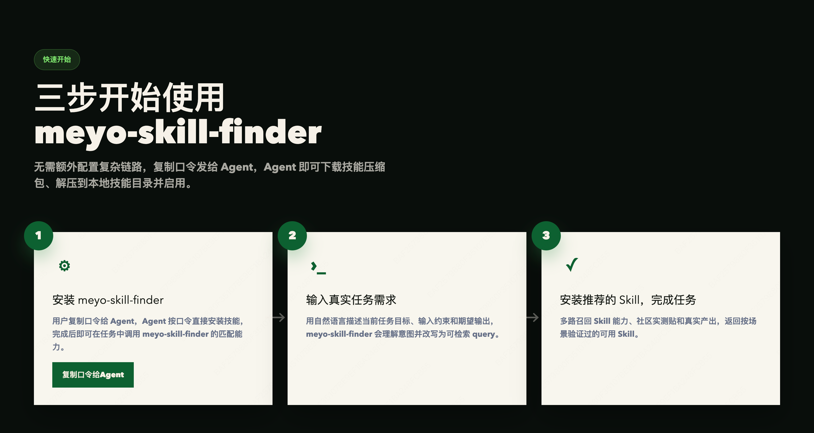
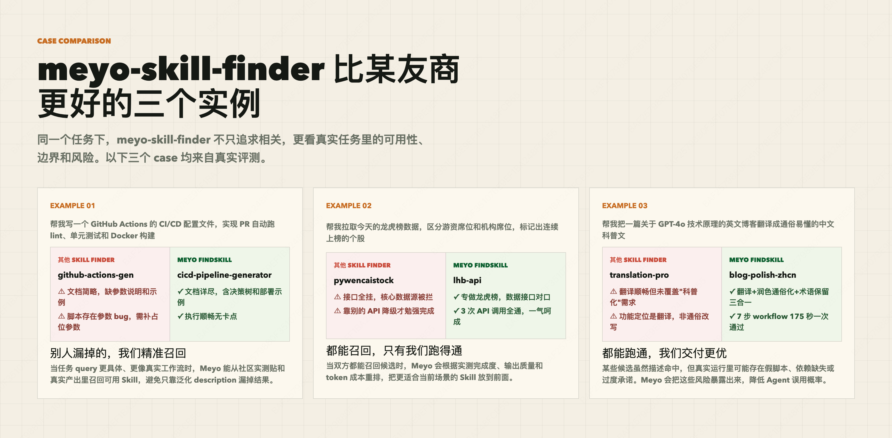

# Deep Skill Finder

> 一键直达：[deep-skill-finder](https://www.meyo123.com/skill)

**别让 Agent 在 Skill 市场里碰运气。**

[deep-skill-finder](https://www.meyo123.com/skill) 不看 Skill 怎么自述，只看它在真实任务里怎么跑。通过社区百万技能实测贴、横向对比和多路召回机制，把 Agent 的当前需求匹配到经战绩验证的 Skill。

一句话：告诉 Agent 你想做什么，它从 [Meyo 社区](https://meyo.sankuai.com) 50000+ Skill 里找到最合适的，确认后一键安装。



## Why it exists

Skill 市场有两个问题：**想找的找不到，找到的不敢用。**

创作者为了覆盖更多搜索，把描述写得宽泛抽象，真实任务进来时关键词对不上，真正适配的 Skill 被埋在大量候选里。而下载量、星标和文档评分不能证明它真的跑通过，边界、依赖、结果质量都不透明。

deep-skill-finder 要解决的就是**发现**和**信任**两件事。



## How it works

Meyo 社区积累了百万量级的真实用户实测数据——用户在真实任务中运行 Skill 并记录下结果。deep-skill-finder 基于这些数据，用 AI Search 把 Agent 的自然语言需求匹配到经过实战验证的 Skill 上。

```
你描述一个真实任务
       |
       v
deep-skill-finder 理解意图，改写为可检索 query
       |
       v
多路召回：同时从 Skill 能力、社区实测贴、真实产出中检索
       |
       v
按场景验证过的战绩排序，返回 TOP 5 推荐
       |
       v
你选一个编号 → 自动安装，立即可用
```

核心能力链路分三步：全网 Skill 获取建立候选池，社区百万真实用户实测数据作为可检索的技能战绩，多路检索召回将需求匹配到可验证的结果上。


## Quick Start

### Install

```bash
git clone https://github.com/wheelry/deep-skill-finder.git \
  ~/.catpaw/skills/deep-skill-finder
```

### Use

用自然语言描述你的任务，deep-skill-finder 会理解意图并匹配：

```
"找个能写公众号深度长文的 skill"
"有没有拉龙虎榜数据的技能"
"帮我搜一个生成 CI/CD 配置的 skill"
"推荐一个英译中科普改写的技能"
```

Agent 返回按相关性排序的推荐列表和推荐理由，选一个编号就帮你装好。



## What makes it different

**不靠 description，靠真实战绩。** 传统 Skill 搜索依赖创作者自己写的描述，deep-skill-finder 用社区真实运行结果来验证和排序。

**多路召回，不只关键词匹配。** 同时从 Skill 能力描述、社区实测贴和真实产出中召回，避免只靠单一信号漏掉最佳选项。

**暴露风险，降低误用。** 假脚本、依赖缺失、过度承诺这些问题会在实测中暴露出来，Agent 不用踩坑后才知道。

## Real-world examples

| 任务 | 其他 Finder | deep-skill-finder | 差异 |
|------|------------|-------------------|------|
| 写 GitHub Actions CI/CD 配置 | 推荐的 Skill 文档简略、脚本有 bug | 推荐文档详尽、执行顺畅的替代方案 | 别人漏掉的，精准召回 |
| 拉取龙虎榜数据 | 推荐的 Skill 接口全挂 | 推荐专做龙虎榜的 Skill，3 次 API 调用全通 | 都能召回，只有我们跑得通 |
| 英文技术博客翻译成中文科普文 | 只做翻译，未覆盖"科普化"需求 | 翻译+润色+术语保留三合一，175 秒一次通过 | 都能跑通，交付更优 |



## Try it now

在线体验 [deep-skill-finder](https://www.meyo123.com/skill)：输入你的真实需求，调用 AI 语义搜索为你匹配 Skill。

[](https://www.meyo123.com/skill)

## Project structure

```
├── SKILL.md                        # Skill 定义文件（Agent 读取）
├── scripts/
│   ├── meyo_skill_search.py        # 语义搜索：调用 Meyo 检索服务
│   └── meyo_skill_install.py       # 下载安装 Skill 到本地
└── references/
    └── meyo-api-guide.md           # Meyo API 参考文档
```

## Requirements

- Python 3.x
- CatPaw

## Links

- [了解 deep-skill-finder](https://www.meyo123.com/skill)
- [了解 Meyo 社区](https://www.meyo123.com/community/home)
- [去 Meyo 社区发现 Skill](https://www.meyo123.com/community/square/skills)

## License

MIT
