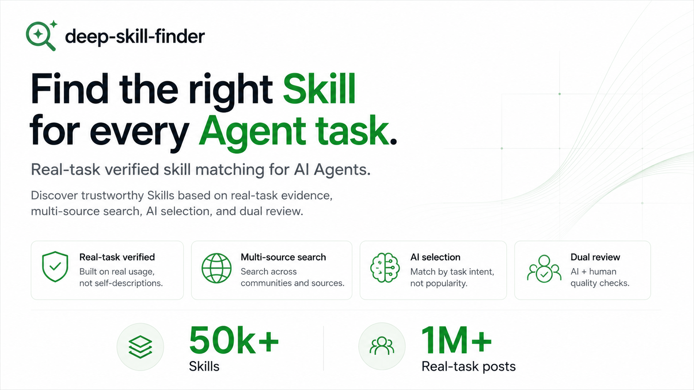

<div align="center">

# 掘技
**基于真实运行战绩，为 Agent 找到最匹配的 AI Skill，别让 Agent 在 Skill 市场里碰运气**



[](LICENSE)
[](https://www.python.org/)
[](https://www.meyo.life)

[English](README.md) | 中文

</div>

---

## 是什么
deep-skill-finder 抓取全网 Skill 内容、建立可评测候选池，通过多路检索召回为你精准匹配最适配当前任务的 Skill。它沉淀社区百万条真实实测记录与 Skill 横向对比报告，帮你在安装前就筛选出经过验证、安全可用的最优解。

## 快速开始

### 前置条件
- 当前有可用的 Agent（支持 Skills 能力）

### 在 Agent 中安装 deep-skill-finder
- 将以下 prompt 直接发送给你的 Agent 即可完成安装：
```text
请安装 deep-skill-finder 技能：从 https://www.meyo.life/api/v1/skill-finder 下载技能压缩包，解压到本地技能目录并启用。
```

### 使用

正常用自然语言与 Agent 对话，无需特殊语法。当任务需要借助外部 Skill 时，Agent 会自动触发搜索与安装流程。示例：

```
"找个能写 GitHub Actions CI/CD 配置的 skill"
"有没有拉股票数据的技能"
"帮我找一个把技术文档翻译成科普文的 skill"
"推荐一个生成长文内容的技能"
```

Agent 返回按相关性排序的推荐列表（最多 5 个）及推荐理由，确认编号后自动完成安装。


## 为什么不直接搜索 Skill 市场？

普通市场搜索有两个根本问题：

1. **发现** — 创作者为了覆盖更多搜索词，把描述写得宽泛抽象。真实任务进来时，关键词匹配会把最合适的 Skill 淹没在大量候选里。

2. **信任** — 下载量和星标无法证明一个 Skill 是否真的跑通过。依赖缺失、边界情况、过度承诺这些问题，往往踩坑之后才知道。

deep-skill-finder 两个都解决：基于真实任务行为召回，基于社区真实运行结果排序——而不是创作者自己说什么就是什么。


## 核心亮点

**全网 Skill 获取** — 抓取全网 Skill 内容，建立可评测候选池，不依赖单一平台的热度排序。

**社区百万实测数据** — 把社区真实任务、运行结果和横评内容沉淀为可检索的 Skill 战绩库。

**多路检索召回** — 同时从 Skill 能力描述、社区实测贴和真实产出中召回，避免单一信号漏掉最优解。

**自主工作流闭环** — 装好后常驻 Agent，自主完成「判断需求 → 多路召回 → 确认安装 → 执行任务 → 使用反馈」，让每次匹配比上一次更准。

**意图驱动精准召回** — 通过理解真实任务意图而非匹配描述关键词，让具体需求也能找到真正合适的 Skill，不被泛化描述淹没。

**战绩驱动排序** — 通过真实跑通率和结果质量对候选排序，让你在多个可用 Skill 之间不必靠运气挑选。

**安全风险前置暴露** — 通过社区实测积累的坑点和边界记录，在安装前就知道哪些 Skill 有隐患，而不是用了才踩坑。


## 工作原理

```
用自然语言描述任务
         │
         ▼
    意图理解
（改写为语义检索 query）
         │
         ▼
      多路召回
  ┌────────┬──────────┐
  │ Skill  │  社区     │
  │ 能力    │  实测帖   │
  └───┬────┴────┬─────┘
      └────┬────┘
           ▼
   按验证战绩排序
   返回 TOP 5 + 推荐理由
           │
           ▼
   选编号 → 自动安装
```


## 项目结构

```
├── SKILL.md                        # Skill 定义文件（Agent 读取）
└── scripts/
    ├── deep_skill_search.py        # 语义搜索：调用 Meyo 检索服务
    └── deep_skill_install.py       # 下载安装 Skill 到本地
```

## 脚本参考

通常不需要直接调用，Agent 会处理。但你也可以独立运行：

**搜索**
```bash
python3 scripts/deep_skill_search.py "你的任务描述" [--agent-type openclaw]
```

**安装 / 卸载 / 列表**
```bash
# 安装
python3 scripts/deep_skill_install.py <skill-name> --dir ~/.catpaw/skills

# 卸载
python3 scripts/deep_skill_install.py <skill-name> --dir ~/.catpaw/skills --uninstall

# 列出已安装
python3 scripts/deep_skill_install.py --dir ~/.catpaw/skills --list
```

## 贡献

欢迎提交 Issue 和 Pull Request。

如果你发现某个 Skill 的推荐排名偏高或偏低，根本信号来自 [Meyo 社区](https://www.meyo.life/community/home)——在那里留下真实的实测记录，是改善未来推荐质量最直接的方式。

## License

基于 [MIT 协议](LICENSE) 开源。可自由使用、修改和分发，保留署名即可。
